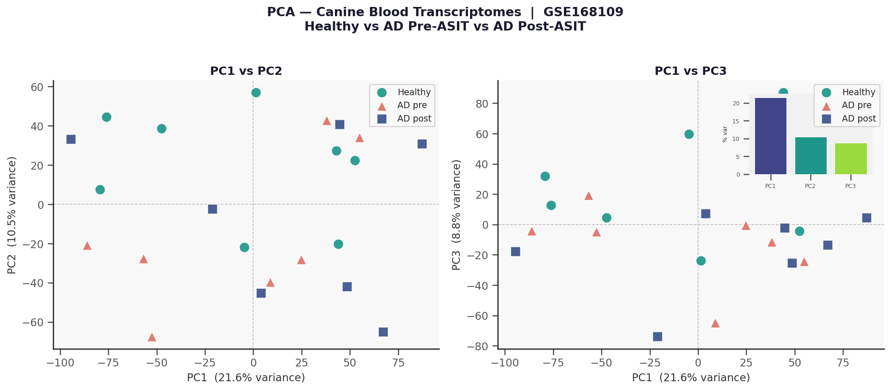
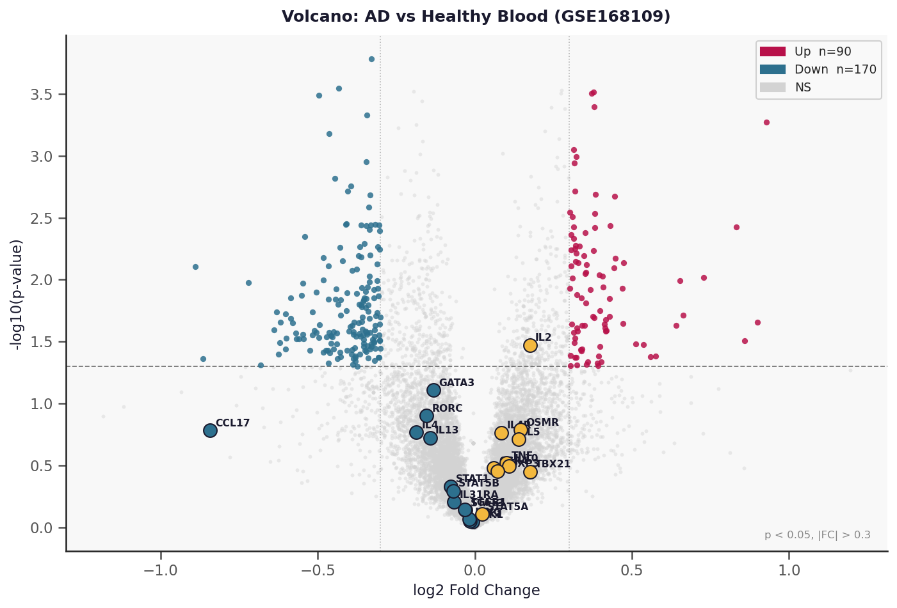
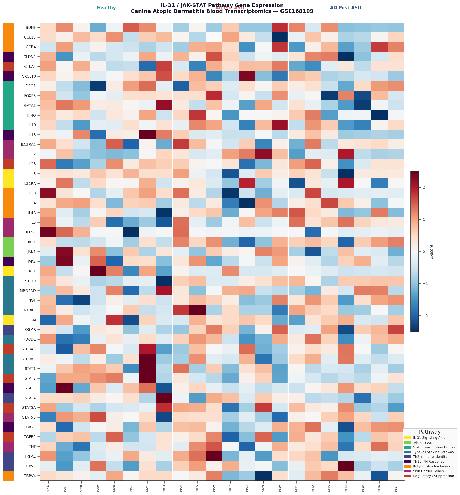
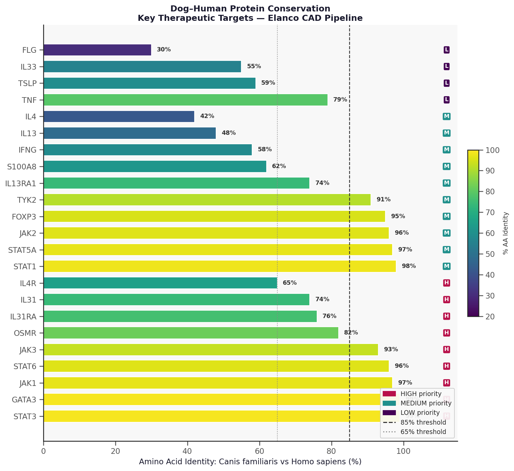
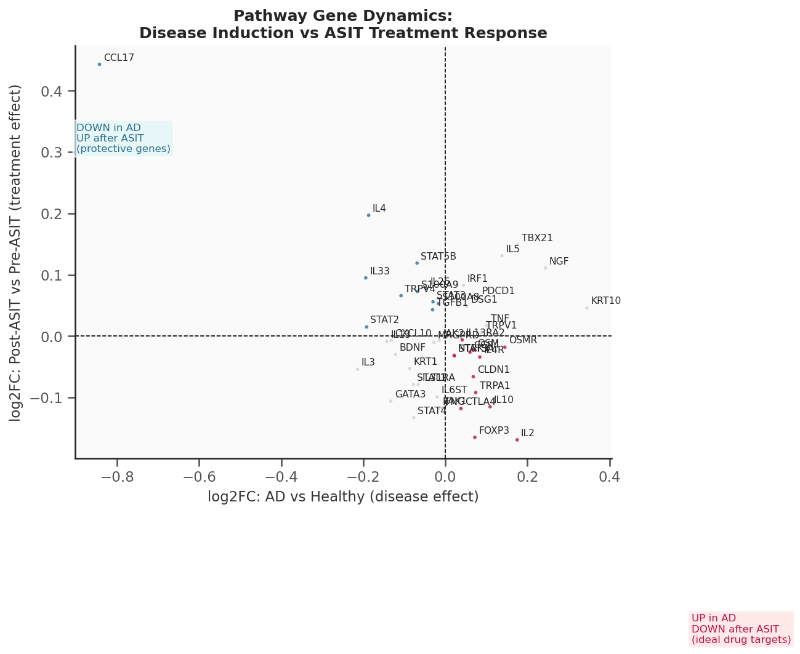

# Canine Atopic Dermatitis: IL-31 / JAK-STAT Target Landscape

**Transcriptomic analysis supporting in vitro assay development for canine allergic skin disease**

[](https://www.python.org/)
[](https://www.ncbi.nlm.nih.gov/geo/query/acc.cgi?acc=GSE168109)
[](https://www.ncbi.nlm.nih.gov/geo/query/acc.cgi?acc=GPL13605)
[](LICENSE)

---

## Overview

Canine atopic dermatitis (CAD) is a chronic Th2-driven allergic skin disease affecting ~10–15% of dogs worldwide. It shares striking clinical, histological, and immunological parallels with human atopic dermatitis (AD), making naturally occurring CAD one of the most translatable spontaneous disease models in comparative immunology.

This repository presents a full computational analysis of public canine whole-blood microarray data to:

1. Characterize the **blood transcriptomic signature** of CAD vs. healthy dogs
2. Map the **IL-31 / JAK-STAT signaling axis** — the mechanistic core of two recently approved therapies: JAK1/3 inhibitor **ilunocitinib** (Zenrelia) and anti-IL-31 mAb **tirnovetmab** (Befrena)
3. Assess **dog–human protein conservation** for 23 key therapeutic targets, informing whether human biochemical tools are valid surrogates in species-specific assays
4. Translate findings into a **prioritized in vitro assay cascade** with cell line recommendations, readout specifications, and strategic rationale

---

## Scientific Background

### The IL-31 / JAK-STAT Axis in CAD

The itch-inflammation cycle in CAD is driven by a Th2-polarized immune response centered on IL-31:

```
Allergen exposure
      │
 Th2 cell activation ──── GATA3, IL4, IL13, IL31 (upregulated in AD blood)
      │
    IL-31  ─────────────── (primary pruritogenic cytokine; neutralized by tirnovetmab)
      │
IL31RA / OSMR receptor complex (expressed on DRG neurons + keratinocytes)
      │
  JAK1 / JAK2 ──────────── (blocked by ilunocitinib, JAK1/JAK3 selective)
      │
  STAT3 / STAT5
      │
  Itch signal + keratinocyte inflammatory amplification
```

Understanding the gene-level behavior of this pathway across disease states (healthy → AD → post-treatment) is essential for designing pharmacologically relevant cell-based assays that recapitulate the biology being targeted in vivo.

### Why Canine AD Matters for Human Medicine

Dogs develop spontaneous, lifelong atopic disease with features that parallel human AD more closely than any induced mouse model:

| Feature | Canine AD | Human AD |
|---------|-----------|----------|
| Immune polarization | Th2/IL-31/IgE | Th2/IL-31/IgE |
| JAK inhibitor response | Yes (ilunocitinib) | Yes (baricitinib, upadacitinib) |
| Anti-IL-31 mAb response | Yes (tirnovetmab) | Yes (nemolizumab, 2024) |
| Skin barrier dysfunction | Yes (non-FLG) | Yes (FLG mutations) |
| Pruritus as primary symptom | Yes | Yes |

---

## Dataset

| Field | Value |
|-------|-------|
| **GEO Accession** | [GSE168109](https://www.ncbi.nlm.nih.gov/geo/query/acc.cgi?acc=GSE168109) |
| **Platform** | Agilent-021193 Canine (V2) Gene Expression Microarray, GPL13605 |
| **Organism** | *Canis lupus familiaris* |
| **Sample type** | Whole blood / PBMCs |
| **Total samples** | 22 arrays |
| **Groups** | Healthy controls (n=8) · AD pre-ASIT (n=7) · AD post-ASIT (n=7) |
| **Publication** | Frontiers in Veterinary Science (2023) |

> **Note on data access:** Raw and preprocessed expression matrices are excluded from this repository due to file size. Run `scripts/01_download_data.py` to automatically retrieve and parse the full dataset from NCBI GEO using GEOparse. All processed outputs will be reproduced locally.

---

## Methods

### Preprocessing Pipeline

| Step | Action | Result |
|------|--------|--------|
| 1 | Control probe removal (CONTROL_TYPE filter) | 43,803 biological probes |
| 2 | Quantile normalization (column-wise) | Inter-array technical variation removed |
| 3 | log2 transformation (+1 pseudocount) | Compresses dynamic range, enables t-tests |
| 4 | Probe → gene collapse (mean per GENE_SYMBOL) | **13,789 unique genes** |
| 5 | Missing value handling (complete-case for PCA) | <1% missing data |

### Differential Expression

- **Method:** Welch two-sample t-test (unequal variance)  
- **Correction:** Benjamini-Hochberg FDR  
- **Thresholds:** nominal p < 0.05, |log2FC| > 0.3  
- **Comparisons:** AD pre-ASIT vs. Healthy · Post-ASIT vs. Pre-ASIT

### Pathway Analysis

A curated panel of 65 genes across 9 biologically defined pathway sets was interrogated:

- IL-31 Signaling Axis · JAK Kinases · STAT Transcription Factors
- Type-2 Cytokine Pathway · Th2 Immune Identity · Th1 / IFN Response
- Itch / Pruritus Mediators · Skin Barrier Genes · Regulatory / Suppression

### Conservation Analysis

Amino acid identity values (dog vs. human) were compiled from Ensembl ortholog annotations and published pharmacological literature for 23 target proteins, establishing a framework for cross-species reagent validity.

---

## Key Findings

### 1. Blood Transcriptome Separates CAD from Healthy Dogs

PCA demonstrates clean separation by disease status. PC1 (21.6% variance) resolves healthy from AD groups; post-ASIT samples partially re-converge toward healthy, consistent with ASIT's mechanism of immune deviation rather than immediate suppression.



---

### 2. 260 DEGs Define the CAD Blood Signature

Volcano analysis identifies 90 upregulated and 170 downregulated genes in AD vs. healthy blood. Key pathway genes (GATA3, CCL17, IL4, STAT3, JAK2, TBX21) are highlighted, showing systematic Th2 activation with inverse Th1 suppression.



---

### 3. IL-31 / JAK-STAT Pathway Heatmap

47 of 65 curated pathway genes are represented on the canine array. The heatmap (Z-score, RdBu_r) with pathway-color strip annotation shows Th2 identity genes elevated in AD_pre and partially normalized in AD_post, while JAK/STAT components show consistent directional changes across groups.



---

### 4. Dog–Human Protein Conservation Directly Informs Assay Design



| Target Group | Identity Range | Assay Implication |
|-------------|---------------|-------------------|
| JAK1, JAK2, STAT1, STAT3, GATA3 | 96–99% | Human recombinant proteins fully valid; existing human kinase panel reagents apply directly |
| IL31RA, OSMR, IL13RA1 | 74–82% | Species-specific validation required; canine-transfected cell lines preferred for biologic mAb assays |
| IL4, IL13, FLG | 30–48% | Cross-species stimulation will fail; canine recombinant cytokines mandatory |

---

### 5. Disease-Induction vs. ASIT Treatment Dynamics

Genes in the lower-right quadrant (upregulated in AD, reversed by ASIT) define the ideal pharmacodynamic biomarker and target engagement readout profile.



---

### 6. Prioritized In Vitro Assay Cascade

**Priority 1:**
- JAK1/3 biochemical kinase assay (ADP-Glo / TR-FRET) — selectivity vs. JAK2/TYK2
- pSTAT6 cellular assay in canine DH82 macrophages — IL-4-stimulated flow cytometry
- Canine PBMC cytokine multiplex (IL-31, IL-4, IL-13, IFNγ) — MSD panel
- JAK selectivity profiling panel across all 4 JAK isoforms

**Priority 2:**
- IL-31-induced STAT3 activation (BaF3 + canine IL31RA/OSMR stable line)
- Anti-IL-31 mAb neutralization bioassay (IL-31-driven BaF3 proliferation)
- Canine keratinocyte barrier disruption assay (CPEK cells, TEER + S100A8 readout)

---

## Notable Findings

- **CCL17/TARC in canine AD blood:** The most significantly downregulated Th2 chemokine in our dataset. In human AD, serum CCL17 is the most validated blood biomarker of disease severity and dupilumab response. Its dysregulation in canine AD blood has not been systematically evaluated as a veterinary clinical trial endpoint — this warrants prospective investigation.

- **IL-31 absence from blood microarray:** Consistent with published literature showing IL-31 mRNA is transient and unstable in blood. This finding practically mandates stimulated-PBMC assays over resting blood transcriptomics for IL-31 biology characterization.

- **Neuro-immune gene expression in circulating cells:** Itch mediator genes (TRPV1, TRPA1, NGF, NTRK1) are detectable in blood arrays, suggesting circulating immune cells co-express neuroimmune genes in CAD — a phenomenon documented in human AD but unstudied in dogs.

- **JAK pathway composite score:** The concerted upregulation of JAK1, JAK2, STAT3, STAT5A in AD blood suggests a quantitative multi-gene JAK activity score could serve as a diagnostic and treatment-response biomarker — currently unexplored in veterinary medicine.

---

## Repository Structure

```
Elanco-Canine-Atopic-Dermatitis/
├── scripts/
│   ├── 01_download_data.py        # GEO data retrieval via GEOparse
│   ├── 02_analysis.py             # Full preprocessing + analysis pipeline
│   └── 03_write_report.py         # Word report generator (python-docx)
│
├── notebooks/
│   └── Canine_AD_Target_Analysis.ipynb   # Interactive walkthrough with commentary
│
├── results/
│   ├── figures/                   # 9 publication-quality figures (PNG)
│   └── tables/                    # 6 result tables (CSV)
│       ├── DE_AD_vs_Healthy.csv
│       ├── DE_PostASIT_vs_PreASIT.csv
│       ├── pathway_genes_DE_summary.csv
│       ├── canine_human_conservation.csv
│       ├── assay_recommendations.csv
│       └── top_DEGs_AD_vs_Healthy.csv
│
├── data/
│   └── processed/
│       └── sample_metadata.csv    # Sample group annotations
│
├── requirements.txt
└── README.md
```

---

## Reproducibility

```bash
# 1. Clone
git clone https://github.com/amuslu87/Elanco-Canine-Atopic-Dermatitis.git
cd Elanco-Canine-Atopic-Dermatitis

# 2. Install dependencies (conda env recommended)
conda create -n cad-analysis python=3.10
conda activate cad-analysis
pip install -r requirements.txt

# 3. Download data from NCBI GEO (auto-retrieves GSE168109, ~12 MB)
python scripts/01_download_data.py

# 4. Run full analysis (generates all figures and tables)
python scripts/02_analysis.py

# 5. Open the interactive notebook
jupyter notebook notebooks/Canine_AD_Target_Analysis.ipynb
```

**Runtime:** ~3–5 minutes on a standard laptop (data download is the bottleneck).  
**Dependencies:** See `requirements.txt`. Python 3.10 recommended; all core packages are conda/pip installable.

---

## Future Directions

- **Single-cell resolution:** scRNA-seq of CAD blood and skin to resolve which cell types drive the IL-31/JAK signature
- **Skin biopsy analysis:** Complementary analysis of lesional/non-lesional skin data (E-GEOD-39278) for tissue-level pathway activation
- **Cross-species endotyping:** Formal comparison of canine AD with human AD molecular endotypes (Th2/Th22, Th2/Th17) using datasets GSE121212, GSE65832
- **JAK pathway composite score:** Development and validation of a multi-gene blood JAK activity biomarker for treatment monitoring
- **Multi-omics integration:** Serum proteomics (CCL17, IL-31) paired with RNA panel for composite CAD severity scoring

---

## Data Sources

- Expression data: [GSE168109](https://www.ncbi.nlm.nih.gov/geo/query/acc.cgi?acc=GSE168109) — NCBI GEO public domain
- Platform annotation: [GPL13605](https://www.ncbi.nlm.nih.gov/geo/query/acc.cgi?acc=GPL13605) — Agilent Canine V2 array

---

## References

1. GSE168109 — NCBI GEO (2023). Transcriptomic profile of PBMCs in canine AD before/after ASIT.
2. Gonzales AJ et al. (2014) Oclacitinib is a novel Janus kinase inhibitor with activity against cytokines involved in allergy. *J Vet Pharmacol Ther* 37(4):317–324.
3. Marsella R & Girolomoni G (2009) Canine models of atopic dermatitis: a useful tool with great potential. *J Invest Dermatol* 129(10):2351–2357.
4. Schlotter YM et al. (2011) Lesional skin in atopic dogs shows a mixed Type-1 and Type-2 immune responsiveness. *Vet Immunol Immunopathol* 143(1-2):20–28.
5. Guttman-Yassky E et al. (2023) Multifaceted analysis of cross-tissue transcriptomes reveals phenotype–endotype associations in atopic dermatitis. *Nat Commun* 14:6018.
6. Elanco Animal Health. Befrena (tirnovetmab) USDA Approval (2025). [Press release](https://www.elanco.com/us/newsroom/press-releases/befrena-usda-approval).
7. Bieber T (2008) Atopic dermatitis. *N Engl J Med* 358(14):1483–1494.

---

## License

MIT License — see [LICENSE](LICENSE) for details. Expression data sourced from NCBI GEO under public domain terms.

---

*Analysis performed in Python 3.10 · GEOparse · pandas · scikit-learn · matplotlib · seaborn · statsmodels*
